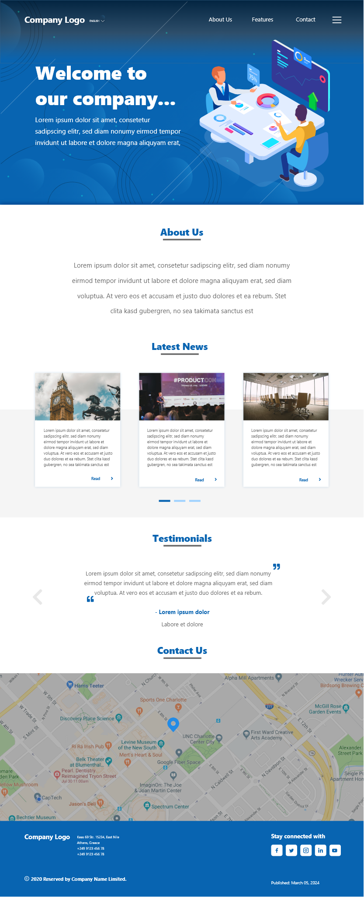

# My-Company Website

## Introduction

This is a company website template that includes basic features to assess website development skills.

## Main Features

The project covers the following technologies and aspects:

- HTML 5
- CSS 3
- SASS
- JavaScript ES6
- Bootstrap 4: Grid Layout

## UI Design

The website is developed based on the UI design available at the following links:

- [XD Design Link](https://drive.google.com/file/d/1K2sSaEvj1pdf9bl5PkZ1Jd1Mws8GBB58/view?usp=drive_link)
- [Image Design Link](https://drive.google.com/file/d/1oooVhbY1xRzGLh8qH_97_ReKt88m-dfc/view?usp=drive_link)

Additional resources such as background images and icons can be found in the following Google Drive folder: [Resource Folder](https://drive.google.com/drive/folders/1ywX_XtCpk28kFXlkuQnHeVVTN1srWPY0?usp=drive_link)

## UI Image



## How to Run the Project

Follow these steps to run the project:

1. Clone the repository:

```
git clone git@github.com:Musthakeem98/My-Company.git
```

2. Navigate to the project directory:

```
cd My-Company
```

3. Install dependencies:

```
npm install
```

4. Open the `index.html` file in your preferred web browser.

## Live Project Link

You can view the live version of the project [here](https://musthakeem98.github.io/My-Company/).
